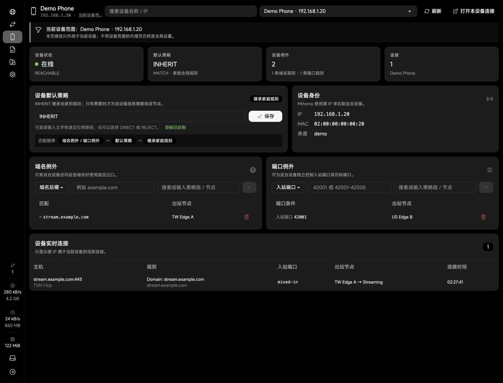
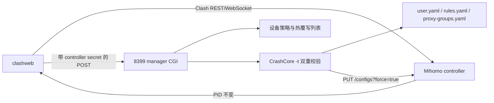
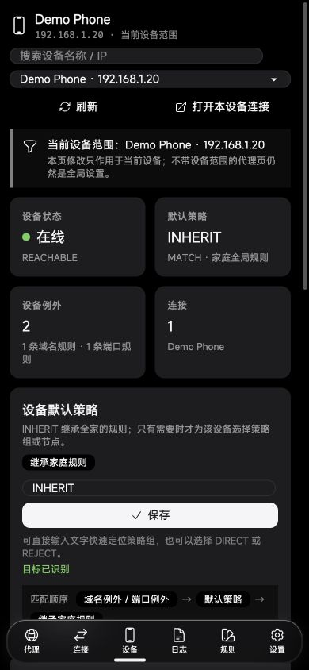
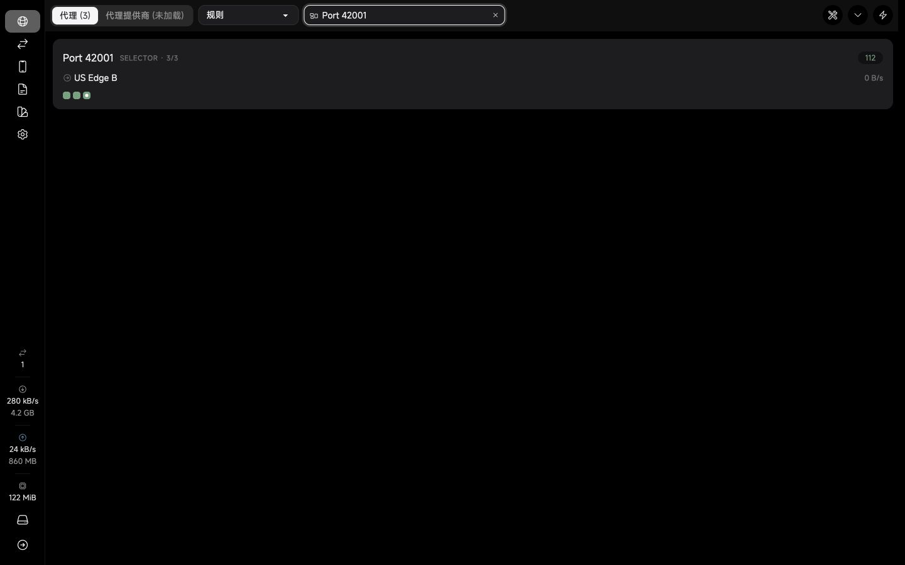
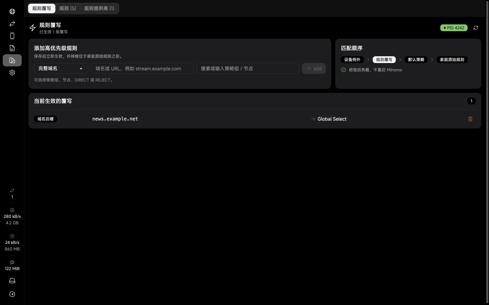
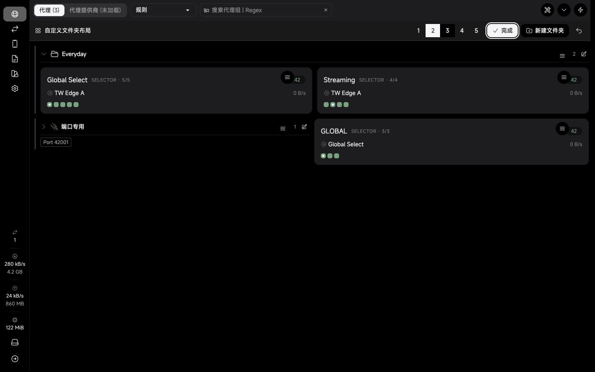

# clashweb

`clashweb` 是一个基于 [Zephyruso/zashboard](https://github.com/Zephyruso/zashboard) 3.21 的 Mihomo 控制面板分支。项目保留上游的新版面板架构，同时保留 clashweb 的多策略组文件夹、拖拽排序、设备级策略、规则热覆写和代理页性能优化。



## 为什么做这个分支

普通 Mihomo 规则只能回答“某个域名走哪里”，但家庭网络经常需要回答更细的问题：

- 某台设备默认继承全家规则，只让少数域名改走另一个出口；
- 同一个端口在不同设备上使用不同策略；
- 临时把单个设备切到固定节点、全局直连或全局拒绝；
- 给全家规则加一条高优先级临时规则，并立即生效；
- 代理组很多时，快速定位组名或节点名；
- `/providers/proxies` 很大时，不能拖慢普通代理页首屏。

## 功能

| 能力                        | 上游 Zashboard 3.21 | clashweb                                     |
| --------------------------- | ------------------- | -------------------------------------------- |
| 搜索模式、连接表格、多后端  | 支持                | 跟随上游实现                                 |
| 多策略组文件夹              | 仅分类视图          | 一个文件夹可放多个策略组                     |
| 文件夹布局                  | 基础分类            | 组内排序、顶层排序、拖入拖出、1-5 列与持久化 |
| 设备默认策略                | 不支持              | `INHERIT`、策略组、节点、`DIRECT`、`REJECT`  |
| 设备域名例外                | 不支持              | `DOMAIN`、`DOMAIN-SUFFIX`                    |
| 设备端口例外                | 不支持              | `IN-PORT`、`DST-PORT`                        |
| 全局高优先级规则热覆写      | 不支持              | 校验、备份、热载、失败回滚                   |
| `/proxies?device=` 安全边界 | 不支持              | 自动跳到设备页，避免误改全家 selector        |
| provider 数据               | 首屏加载            | 打开 provider 标签时才加载                   |
| selector 切换               | 等待完整刷新        | 立即更新界面，只回读当前策略组               |

设备规则的优先级是：

```text
设备域名/端口例外 > 全局热覆写 > 设备默认策略 > 原始家庭规则
```

设备默认策略为 `INHERIT` 时不会创建固定出口，未命中设备例外的流量继续执行原始家庭规则。

### 策略组文件夹

代理页的“编辑布局”模式用于管理策略组：

- 新建任意文件夹，把多个 selector 拖入同一文件夹；
- 在文件夹内调整策略组顺序，也可拖出回顶层；
- 调整文件夹和顶层策略组顺序；
- 设置 1-5 列、文件夹宽度、高度、名称和 emoji；
- 成员、顺序和展开状态在刷新后保留，升级时继续使用旧版 clashweb 的存储键。

## 架构



设备隔离使用 Mihomo 原生 `SRC-IP-CIDR` 与 `SUB-RULE`，不是简单的 LAN 黑白名单。管理器会先生成候选配置，用当前 CrashCore 校验持久配置和运行时配置；校验失败或热载失败时恢复备份。

## 本地演示

演示服务只使用虚构数据，不连接真实路由器：

```bash
corepack enable
pnpm install --frozen-lockfile
pnpm demo
```

打开终端打印的 `http://127.0.0.1:4173/...` 地址。演示包含：

- 设备 `192.168.1.20`；
- 域名 `stream.example.com`；
- 节点 `TW Edge A` 与 `US Edge B`；
- 同时容纳 `Global Select` 和 `Streaming` 的 `Everyday` 文件夹；
- 可写但只存于内存的设备规则与全局热覆写。

演示数据的关键界面：

| 单设备继承与例外                                   | 手机布局                                              |
| -------------------------------------------------- | ----------------------------------------------------- |
|  |  |

| 策略组搜索                                       | 高优先级规则热覆写                                 |
| ------------------------------------------------ | -------------------------------------------------- |
|  |  |

| 多策略组文件夹                                          |
| ------------------------------------------------------- |
|  |

## 构建面板

需要 Node.js 22+ 与仓库锁定的 pnpm 11：

```bash
corepack enable
pnpm install --frozen-lockfile
pnpm type-check
VITE_BASE_URL=/ pnpm build
```

`VITE_BASE_URL=/` 适合路由器把 SPA 暴露在 `/ui/`、静态资源放在站点根目录的部署。普通相对路径部署可以直接运行 `pnpm build`。

将 `dist/` 放到静态 Web 根目录。例如临时验证：

```bash
uhttpd -f -h /path/to/dist -I index.html -E /index.html -p 0.0.0.0:19999
```

生产环境应交给现有 init/procd 服务管理，不要仅依赖前台命令。

## 安装路由器管理器

当前脚本面向 OpenWrt/BusyBox + ShellCrash + Mihomo，默认自动发现 `/mnt/usb-*/ShellCrash`。先完整备份 ShellCrash 配置，再在路由器上执行：

```bash
chmod 700 router/install.sh router/mihomo-manager.sh
router/install.sh
```

安装器会：

1. 从 `ShellCrash.cfg` 读取 controller secret，不在仓库中保存密钥；
2. 备份已有 `/data/mihomo_manager.sh` 与 CGI；
3. 安装 8399 CGI，并启动独立 uhttpd；
4. 输出安装路径和备份路径，不输出密钥。

面板中的 Mihomo 后端密码必须与 ShellCrash controller secret 一致。设备页和规则覆写页复用这一个 secret，所有 8399 请求都必须认证。

脚本还包含历史上的透明代理、防火墙和配置同步能力。只需要设备策略时，不要开启不理解的额外命令；先用演示环境和测试路由器验证。

## 升级与回滚

升级上游时优先保留上游实现，只重放本项目仍缺失的功能：

```bash
git remote add upstream https://github.com/Zephyruso/zashboard.git
git fetch upstream
git rebase upstream/main
pnpm install --frozen-lockfile
pnpm type-check
pnpm build
```

部署建议使用目录级切换：

1. 复制当前静态目录到带时间戳的备份；
2. 把新 `dist/` 上传到独立暂存目录；
3. 校验 `index.html` 和入口 JS 存在；
4. 原子替换静态目录；
5. 验证普通代理页、provider 懒加载、设备页和规则覆写页；
6. 确认 Mihomo PID 未变化。

回滚只需把旧静态目录移回原路径。规则管理器每次写入前还会在 `services/mihomo-manager/device-policy-backups/` 保存配置级备份。

## 安全与隐私

- 仓库、演示数据和截图不包含真实节点、域名、设备 IP、MAC、流量、订阅地址或备份路径；
- controller secret 不应写入源码、构建产物、README、Issue 或截图；
- 8399 默认是 HTTP，只应监听可信 LAN；需要跨网访问时请放在 HTTPS 和访问控制之后；
- 不要把 Mihomo controller 或 8399 直接暴露到公网；
- 发布日志前先检查节点名、域名、源 IP、MAC 和订阅信息。

## 验证

```bash
pnpm type-check
pnpm exec eslint src demo
pnpm build
sh -n router/mihomo-manager.sh
sh -n router/install.sh
```

项目已在桌面和手机断点验证无横向溢出。普通代理页只请求核心 `/proxies`；provider 标签才请求 `/providers/proxies`。

## 许可与致谢

本项目继续使用上游 MIT License，并保留原作者版权声明。感谢 [Zashboard](https://github.com/Zephyruso/zashboard) 与 [Mihomo](https://github.com/MetaCubeX/mihomo)。
